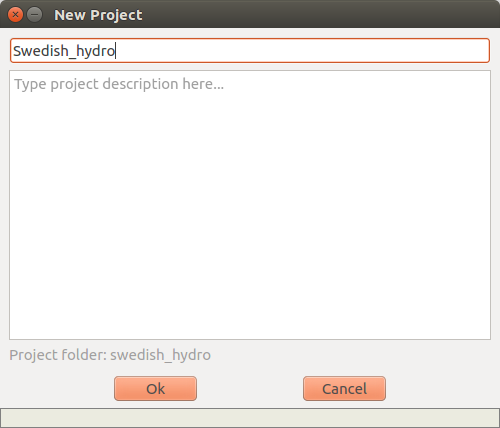
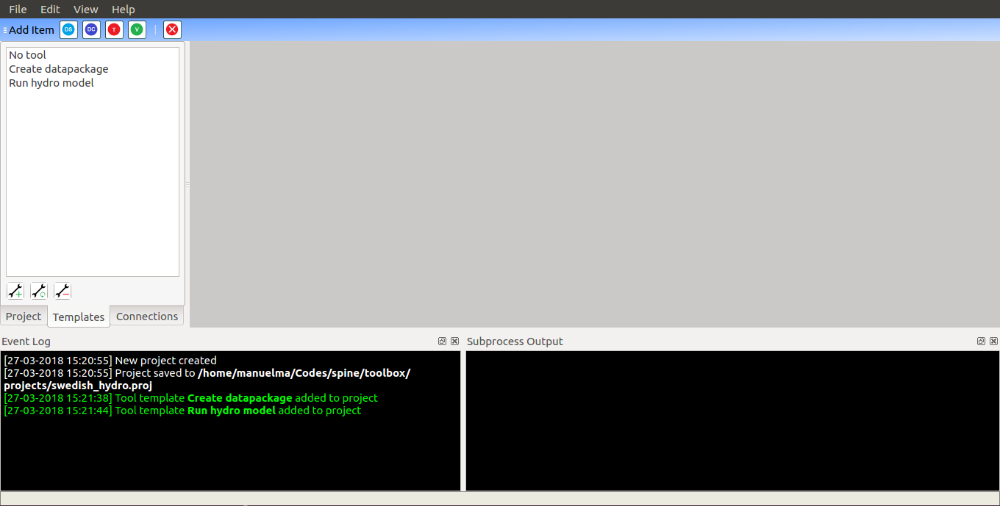
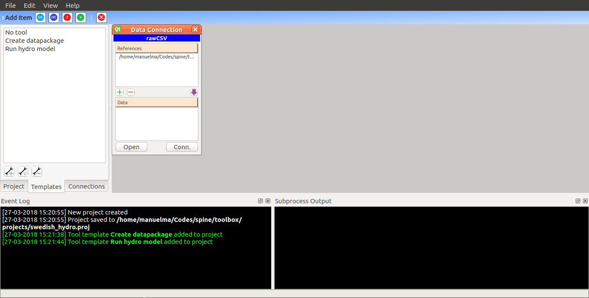
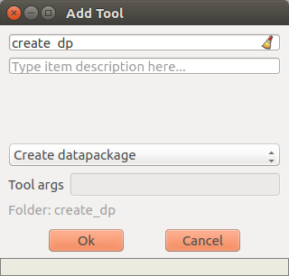
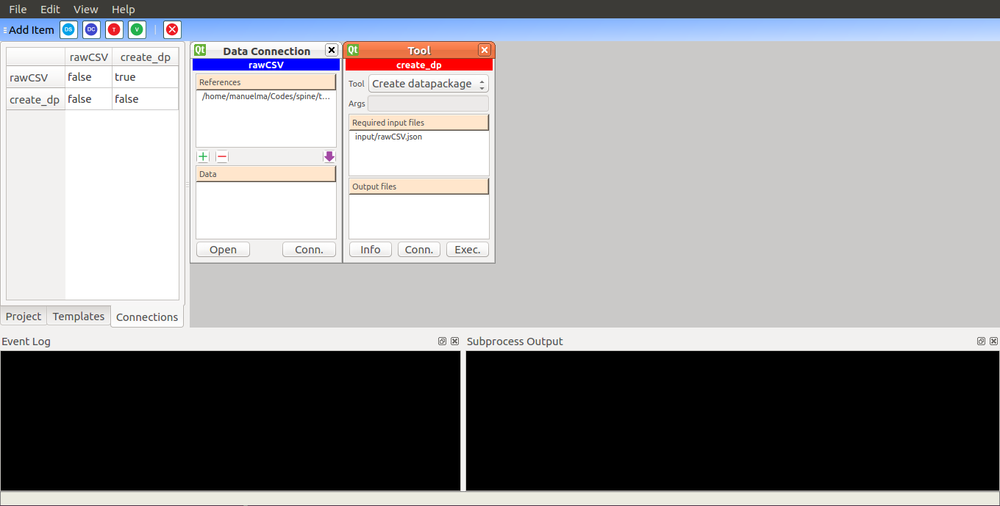
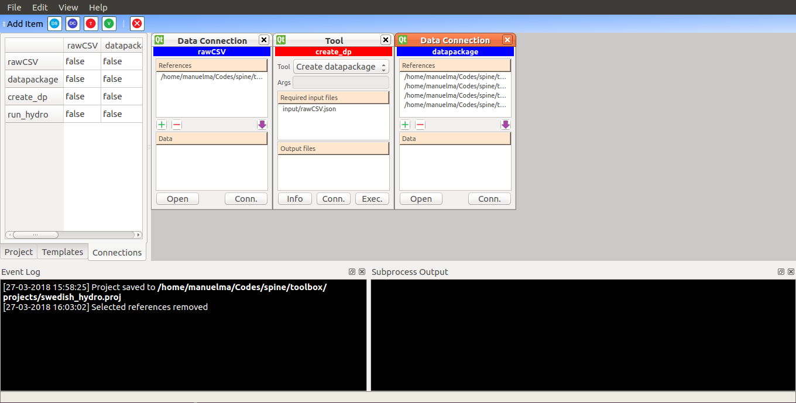
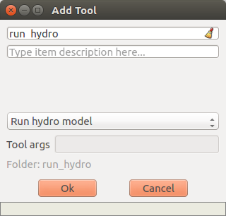
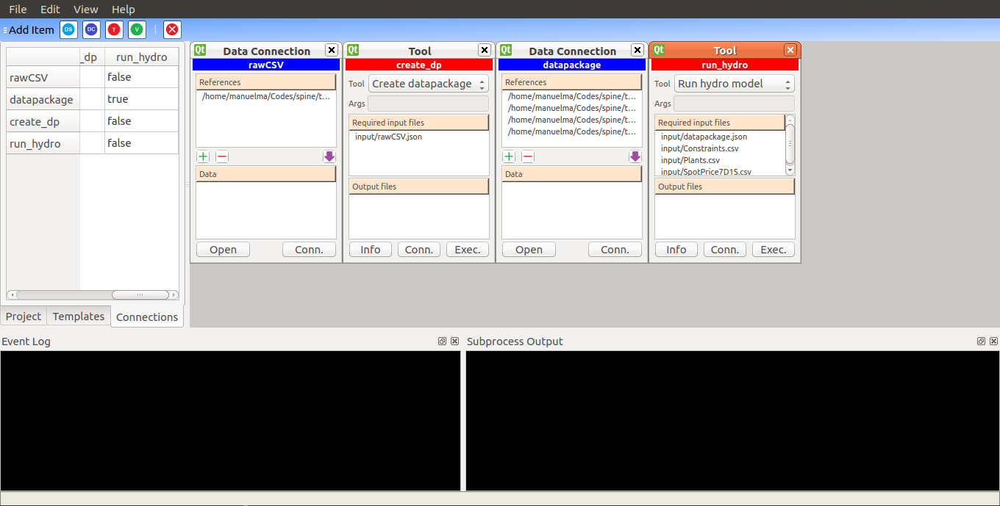

# Spine Toolbox

An application to define, manage, and execute various energy system
simulation models.

## Requirements

- Python 3.5+
- PySide2 for Qt 5.6+

### Installing PySide2

There are three options for installing PySide2

- Installing PySide2 for Anaconda & Miniconda (3.5+)
- Installing PySide2 on a ‘clean’ Python (3.5+)
- Installing PySide2 by building sources (Python 2 & 3)

Each option is presented below.

#### Installing PySide2 for Anaconda & Miniconda Python (3.5+)

PySide2 for Qt 5.6.2 is available on the conda-forge channel. You can install all requirements by running

    conda install --channel conda-forge --file requirements.txt

in the Spine Toolbox root folder.

Alternatively, create a separate environment for the Toolbox with

	conda create --name spinetoolbox --channel conda-forge --file requirements.txt

#### Installing PySide2 on a ‘clean’ Python (3.5+)

Download wheel from [http://hansch.info/PySide2/](http://hansch.info/PySide2/)

The following wheels are available:
PySide2 for Qt 5.6.2 (Python 3.5 and Python 3.6)
PySide2 for Qt 5.9.0 (Python 3.6)

Install with e.g.

    pip install PySide2-5.9-cp36-cp36m-win_amd64.whl

Make text file `qt.conf` into the folder where your `python.exe`
resides with the following contents:

    [Paths]
    Prefix = /Python36/Lib/site-packages/PySide2
    Binaries = /Python36/Lib/site-packages/PySide2

If your PySide2 folder is in another path, modify Prefix and Binaries
lines accordingly.

Spine Toolbox should now work and you are ready to develop the core
application components. If you want to develop the Graphical User
Interface (views, buttons, menus, etc.) you need the PySide2 GUI
development tools.

#### Installing PySide2 GUI Development Tools (Windows)

These instructions have been tested when the Qt 5.9.0 wheel
PySide2-5.9-cp36-cp36m-win_amd64.whl has been installed.

Developing Spine Toolbox GUI requires

- `designer.exe`
- `pyside2-uic.exe`
- `pyside2-rcc.exe`

To make `designer.exe` work, copy `qt.conf` file into the folder where
it is located. It should be in the folder where PySide2 was installed
(e.g. C:\Python36\Lib\site-packages\PySide2)

`designer.exe` should now work.

`pyside2-uic.exe` is in your Python scripts folder
(e.g. C:\Python36\Scripts). To make it work, clone `pyside-setup`
project from https://code.qt.io/pyside/pyside-setup.git.

Checkout branch `dev`.

Go to folder \pyside-setup\sources\pyside2-tools\pyside2uic

Copy folders:

    \Compiler
    \port_v2
    \port_v3
    \widget-plugins

into your local pyside2uic folder
(e.g. C:\Python36\Lib\site-packages\pyside2uic)

At least \Compiler and \port_v3 folders are required.

`pyside2-rcc.exe` should be in the same folder as `designer.exe`.

Add your Python scripts (e.g. C:\Python36\Scripts) and PySide2
(e.g. C:\Python36\Lib\site-packages\PySide2) folders into your PATH
variable.

#### Installing PySide2 by building sources (Python 2 & 3)

You can install PySide2 by building the source package yourself. Instructions
on how to do this can be found on the getting started page of the official
PySide2 wiki
[https://wiki.qt.io/PySide2_GettingStarted](https://wiki.qt.io/PySide2_GettingStarted)

Follow the instructions on the page according to your OS.

## Preparing and starting Spine Toolbox

Run `build_ui.bat` from your Python/PySide2 enabled command window to generate
the code for the Spine Toolbox user interface.
After modifying the user interface (*.ui) files with `designer.exe`, re-run
`build_ui.bat` to build the Spine Toolbox interface anew.

In the command prompt, run `python spinetoolbox.py` in the `spinetoolbox` folder.

## Examples

### Swedish hydro model

This example runs a small hydro model on the Swedish hydropower system. Input data is collected in raw CSV format and used to build a tabular datapackage. The tabular datapackage is used together with the `SpineData` Julia package to import data into Spine in a custom way.

#### Preliminaries

This example assumes that you have Julia with the following packages installed:
- [JuMP](https://github.com/JuliaOpt/JuMP.jl)
- [Clp]()
- [SpineData]()

Follow the above links and complete the installation instructions for each package.

Then, run the `configure_dc.jl` Julia script in the `tool_templates/Swedish_hydro/input` folder to set up a correct data connection for your system:

```
$ julia configure_dc.jl
```

#### Create a new project

Open the Spine toolbox and select `File/New` to create a new project. Give it a name such as 'Swedish_hydro' and hit `Ok`.



#### Add tool templates

Select the `Templates` tab at the bottom of the left pane and click on the button with a wrench and a plus sign to add a new tool template.

Navigate to the `tool_templates/Swedish_hydro` folder, select the file `create_datapackage.json` and hit `Open`. Repeat for the `run_hydro_model.json` file. Now you should see your two tool templates on the left pane:



#### Add data connection to raw CSV data

Click on the `DC` button to add a new data connection to our project. Give it a name such as 'rawCSV' and click `Ok`. On the 'rawCSV' Data Connection item, click on the button with plus sign to add a new reference. Navigate to the `tool_templates/Swedish_hydro/input` folder, select the file `rawCSV.json` and click `Ok`:



#### Add and execute tool to create datapackage from raw CSV data connection

Click on the `T` button to add a new tool to our project. Give it a name such as 'create_dp', then select 'Create datapackage' from the dropdown list, and click `Ok`:




Select the `Connections` tab at the bottom of the left pane, and click on the element under column 'create_dp', row 'rawCSV', so it says 'true', as shown below:



On the 'create_dp' Tool item, click on `Exec.` to run the tool. You should see the output of the tool on the bottom right pane.


#### Add data connection to tabular datapackage

Click on the `DC` button to add a new data connection to our project. Give it a name such as 'datapackage' and click `Ok`. On the 'datapackage' Data Connection item, click on the button with plus sign to add a new reference. Navigate to the `tool_templates/Swedish_hydro/input` folder, select the files `datapackage.json`, `Plants.csv`, `Constraints.csv`, and `SpotPrice7D1S.csv`, and click `Ok`:



#### Add and execute tool to run hydro model from tabular datapackage connection

Click on the `T` button to add a new tool to our project. Give it a name such as 'run_hydro', then select 'Run hydro model' from the dropdown list, and click `Ok`:




Select the `Connections` tab at the bottom of the left pane, and click on the element under column 'run_hydro', row 'datapackage', so it says 'true', as shown below:



On the 'run_hydro' Tool item, click on `Exec.` to run the tool. You should see the output of the tool on the bottom right pane.
